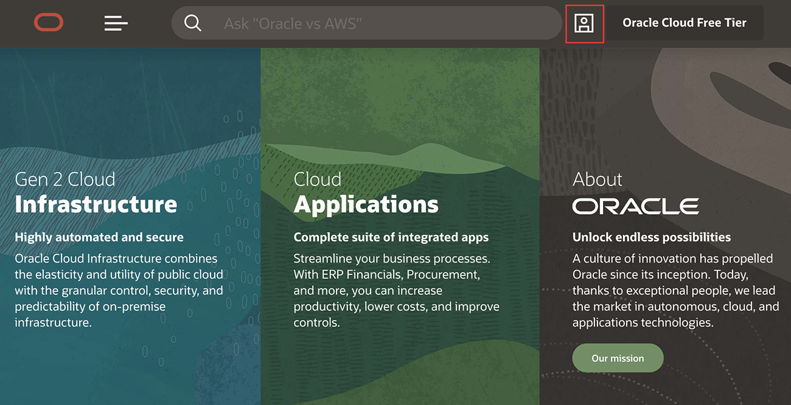
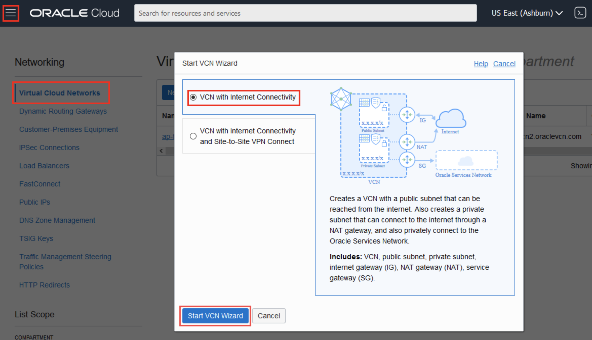

# Lab 1: Function Setup by Administrator

## Before You Begin
### Objectives
- Sign in to Oracle Cloud Infrastructure

### Requirements
To complete this lab, you need to have the following:
- Login credentials and a tenancy name for the Oracle Cloud Infrastructure Console


***We recommend that you create a notes page to write down all of the credentials you will need.***

## **STEP 1:** Your Oracle Cloud Trial Account

You have already applied for and received your Oracle Cloud Free Tier Account.

## **STEP 2:** Log in to your OCI dashboard

- From any browser go to oracle.com to access the Oracle Cloud.

    [https://www.oracle.com/](https://www.oracle.com/)

    

- Click the icon in the upper right corner.  Click on **Sign in to Cloud** at the bottom of the drop down.   

     
 
- Enter your **Cloud Account Name** in the input field and click the **Next** button.  *NOTE:  Do NOT click the Sign-In button, this will take you to Single Sign-On, not the Oracle Cloud*

  
    
- Enter your username (this may be your email address) and password and click on **Sign In**.  **Note this is NOT your email. This is the name of your tenancy noted in the email you received during signup**

  

- Once you log in you will see a page similar to the one below.

   

## **STEP 3:** Create groups and users

- If suitable users and groups don't exist already, log in to the Console as a tenancy administrator and under **identity** and click User (if you user does not exist) and **Groups**.  

  

- Create a new group by clicking **Groups** and then Create Group..

  

- Create a new user by clicking Users and then Create User. Add a user to a group by clicking Groups, then the name of the group, and then Add User to Group.
  
  


## **STEP 4:** Create compartment.

- If a suitable compartment in which to create network resources and Oracle Functions resources doesn't exist already, log in to the Console as a tenancy administrator and under identity, go to Compartments.
  

- Click Compartments and then Create Compartment.

  

## **STEP 4:** Create VCN and subnets.

- If a suitable VCN in which to create network resources doesn't exist already, log in to the Console as a tenancy administrator and under Core Infrastructure, go to Networking and then Click Virtual Cloud Networks and choose a compartment.
  
- Click Start VCN Wizard, then VCN with Internet Connectivity, then Start VCN Wizard.

  

- Enter a name for the new VCN, click Next, and then click Create to create the VCN along with the related network resources.
  
  
  

## **STEP 5:** Create a dynamic group.

- Navigate to **identity** and click  **Dynamic Groups**.  
  
  

- Create create dynamic group fnfunc and give matching rule
  ```
  <copy>
  ALL {resource.type = 'fnfunc', resource.compartment.id ='compartment_ocid'
  </copy>
  ```
  
## **STEP 6:** Create policy for group.

- Log in to the Console as a tenancy administrator and under Identity and click Policies and then:

- If one or more Oracle Functions users is not a tenancy administrator, select the tenancy's root compartment and create a new policy with the following policy statements:
```  
<copy>Allow group group_name to manage objects in tenancy</copy>
```
```
<copy>Allow group group_name to manage buckets in tenancy</copy>
```
```
<copy>Allow group workforce to manage logging-family in tenancy</copy>
```
```
<copy>allow service FAAS to read repos in tenancy</copy>
```
```
<copy>allow service FAAS to use virtual-network-family in tenancy</copy>
```
```
<copy>Allow group group_name to use cloud-shell in tenancy</copy> 
```
```       
<copy>Allow group group_name to manage api-gateway-family in compartment compartment_name</copy> 
```
```  
<copy>Allow group group_name to manage functions-family in tenancy</copy>  
```
```  
<copy>Allow group group_name to manage virtual-network-family in compartment compartment_name</copy>  
```
```        
<copy>Allow group group_name to manage repos in tenancy</copy>  
```
```       
<copy>Allow group group_name to read objectstorage-namespaces in tenancy</copy>  
```
```  
<copy>Allow group developers to manage repos in tenancy</copy>        
```
```    
<copy>Allow dynamic-group fnfunc to manage objects in compartment compartment_name</copy>
```
```
<copy>ALLOW any-user to use functions-family in compartment compartment_name where ALL { request.principal.type= 'ApiGateway' , request.resource.compartment.id = 'compartment_ocid'}</copy>
```


**This completes the Lab1**

**You are ready to proceed to Lab 2**
