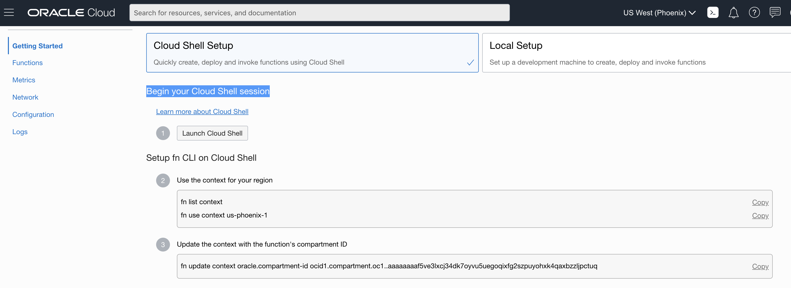

# Lab2: API Upload to Object Storage and PUT to Astute

## Before You Begin
### Objectives
- Sign in to Oracle Cloud Infrastructure
- Clone source code from Github into Cloud Shell. 
- Create application in Functions.
- Create, deploy, and invoke your function.


### Requirements
To complete this lab, you need to have the following:
- Login credentials and a tenancy name for the Oracle Cloud Infrastructure Console


## **STEP 1**: Sign in to Oracle Cloud Infrastructure and upload csv file.
- If you already logged in you continue to upload csv file.

- Navigate to Object Storage.
  
  

- Select right compartment and select output object storage bucker.

  

- Click upload button
 
  

- Select csv file and upload

  

## **STEP 2:** Log in to your OCI dashboard Cloud Shell.

- Click Cloud Shell icon.
  
  

- Await while to your load Cloud Shell.
  
  

- You can see your Cloud Shell now.

  

## **STEP 3:** Clone source code from Github into Cloud Shell.  

- Copy following command and paste it into Cloud Shell.

  ```
  <copy>
  git clone https://github.com/sasankapdn/function_project_example_1.git
  </copy>
  ```
  

## **STEP 4:** Create application in Functions.  

- Log in to the Console as a functions developer and under Solutions and Platform, go to Developer Services and click Functions, and select the compartment in which to create Oracle Functions resources.

  

- Click **Create Application** and specify: **workforce-fn** as the name for the new application. You'll deploy your  function in this application, and specify this application when invoking the function

  

- Select the VCN and subnet in which to run the function. Click **Create**

  

- Click Function you created now.

  

- Click **Getting Started**.

  

- Scroll down and copy and past commands under **Setup fn CLI on Cloud Shell**

  

- Continue Steps 2, 3, 4 and Click **Generate an Auth Token** link to generate an Auth Token

- Select **Auth Tokens** on the left, and then **Generate Token**.  Create token **weblogic_token**. (You can specify any description )

  

  

- Copy the token and save it in your notes.  If you lose this you can always generate more tokens.

  

- Continue steps 6 and copy command and past it into Cloud Shell using the **Auth Token** as your password.

  

- Continue Step 7 in **Getting Started**.

## **STEP 5:** Create, deploy, and invoke your function. 

- Copy and paste following command into Cloud Shell

```
<copy>
cd function_project_example_1/get-object-content/oci-objectstorage-get-object-java
</copy>
```

- Deploy your function 
  
```
<copy>
fn -v deploy --app [Function_App_Name]
</copy>
```
- Invoke your function
```
<copy>
echo -n '{"name": "convertcsv2.csv", "bucketName":"output"}' | fn invoke [Function_App_Name]  oci-objectstorage-get-object-java
</copy>
```
- You can see your csv file content in the Cloud Shell terminal

- Deploy updated function
```
<copy>
cd ~
cd function_project_example_1/oci-objectstorage-get-object-java
</copy>
```
```
<copy>
fn -v deploy --app [Function_App_Name]
</copy>
```
-  Invoke your function
```
<copy>
echo -n '{"name": "convertcsv2.csv", "bucketName":"output","accessToken":"ENTER YOU ACCESS TOKEN"}' | fn invoke [Function_App_Name]  oci-objectstorage-get-object-java
</copy>
```

