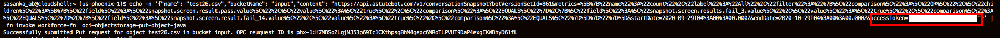
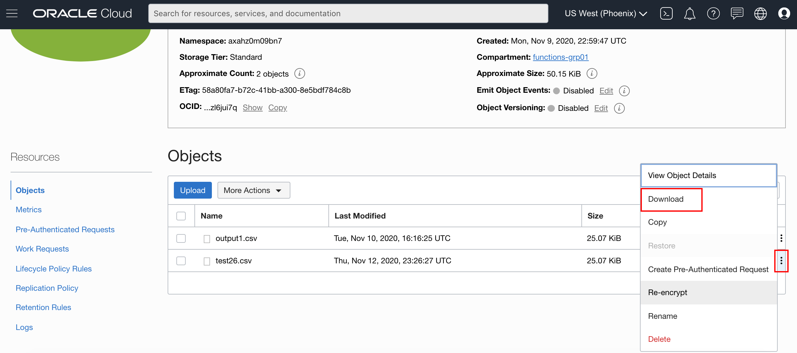

# Response file sent back to Object Storage

## Before You Begin
### Objectives
- Get docker images and put them into your VM registry


### Requirements
To complete this lab, you need to have the following:
- Login credentials and a tenancy name for the Oracle Cloud Infrastructure Console


## **STEP 1**: Create, deploy, and invoke your function.
- Copy and paste following command into Cloud Shell

```
<copy>
cd ~
cd function_project_example_1/oci-objectstorage-put-object-java/
</copy>
```

- Deploy your function 
  
```
<copy>
fn -v deploy --app workforce-fn
</copy>
```

- Invoke your function and include your accessToken end of response url.
```
<copy>
echo -n '{"name": "test26.csv","bucketName": "input","content": "https://api.astutebot.com/v1/conversationSnapshot?botVersionSetId=861&metrics=%5B%7B%22name%22%3A%22count%22%2C%22label%22%3A%22All%22%2C%22filter%22%3A%22%7B%5C%22comparison%5C%22%3A%5C%22OR%5C%22%2C%5C%22children%5C%22%3A%5B%7B%5C%22field%5C%22%3A%5C%22snapshot.screen.result.pass.value%5C%22%2C%5C%22value%5C%22%3A%5C%22true%5C%22%2C%5C%22comparison%5C%22%3A%5C%22EQUALS%5C%22%7D%2C%7B%5C%22field%5C%22%3A%5C%22snapshot.screen.results.fail_3.value%5C%22%2C%5C%22value%5C%22%3A%5C%22true%5C%22%2C%5C%22comparison%5C%22%3A%5C%22EQUALS%5C%22%7D%2C%7B%5C%22field%5C%22%3A%5C%22snapshot.screen.result.fail_14.value%5C%22%2C%5C%22value%5C%22%3A%5C%22true%5C%22%2C%5C%22comparison%5C%22%3A%5C%22EQUALS%5C%22%7D%5D%7D%22%7D%5D&startDate=2020-09-29T04%3A00%3A00.000Z&endDate=2020-10-29T04%3A00%3A00.000Z&accessToken="}' | fn invoke workforce-fn  oci-objectstorage-put-object-java
</copy>
```


## **STEP 2**: Locate and download response file in csv format.

- Navigate to Object Storage **input** bucket and confirmed with response csv file.
  
  

- Download response csv file as follows.

  
- **This completes Lab 3 and the Workshop**

**This completes the Workshop**
